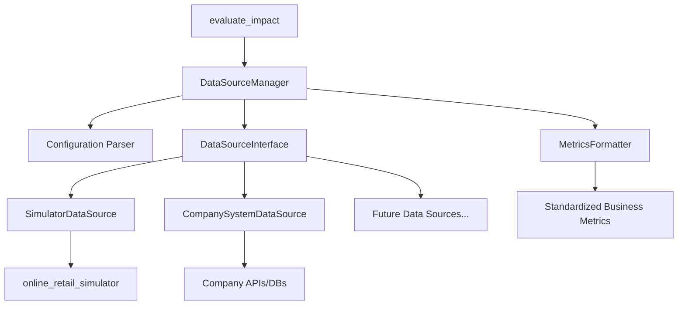

# Data Abstraction Layer Design Document

## Overview

The Data Abstraction Layer provides a unified interface for retrieving business metrics from multiple data sources to support impact analysis. The system implements a plugin-based architecture that allows seamless integration of different data providers while maintaining a consistent API for the `evaluate_impact` function.

The design follows the Strategy pattern to enable runtime selection of data sources based on configuration, with built-in support for the existing `online_retail_simulator` package and extensibility for future company systems.

## Architecture

The system consists of four main components:

1. **DataSourceManager**: Central coordinator that manages data source selection and configuration
2. **DataSourceInterface**: Abstract base class defining the contract for all data sources
3. **ConcreteDataSources**: Specific implementations for different data providers (SimulatorDataSource, CompanySystemDataSource)
4. **MetricsFormatter**: Standardizes output format across all data sources



## Components and Interfaces

### DataSourceManager

The central component responsible for:
- Loading and validating configuration files
- Instantiating appropriate data source implementations
- Coordinating data retrieval operations
- Handling errors and logging

**Key Methods:**
- `load_config(config_path: str) -> Dict`
- `get_data_source(source_type: str) -> DataSourceInterface`
- `retrieve_metrics(products: List[str], time_range: TimeRange) -> pd.DataFrame`

### DataSourceInterface

Abstract base class defining the contract for all data source implementations:

```python
class DataSourceInterface(ABC):
    @abstractmethod
    def connect(self, config: Dict) -> bool:
        """Establish connection to data source"""
        pass
    
    @abstractmethod
    def retrieve_business_metrics(self, products: List[str], start_date: str, end_date: str) -> pd.DataFrame:
        """Retrieve business metrics for specified products and time range
        
        Returns DataFrame with standardized schema including:
        - Product catalog info (product_id, name, category, price)
        - Time-series metrics (date, sales_volume, revenue, inventory_level, customer_engagement)
        - Metadata (data_source, retrieval_timestamp)
        """
        pass
    
    @abstractmethod
    def validate_connection(self) -> bool:
        """Validate data source connectivity"""
        pass
    
    @abstractmethod
    def get_available_metrics(self) -> List[str]:
        """Return list of available metric types"""
        pass
```

### SimulatorDataSource

Concrete implementation for the `online_retail_simulator` package:
- Uses `simulate_characteristics()` to get product catalog (product_id, name, category, price)
- Uses `simulate_metrics()` to generate time-series business metrics (date, quantity, revenue) for the specified products and date range
- Maps simulator output to standardized schema (quantity → sales_volume, adds inventory_level and customer_engagement)
- Handles simulator-specific configuration parameters (mode, seed, date ranges)

### CompanySystemDataSource

Extensible base class for company system integrations:
- Provides common functionality for database/API connections
- Implements authentication mechanisms
- Handles data transformation and normalization

## Data Models

### Configuration Schema

```json
{
  "data_source": {
    "type": "simulator|company_system",
    "connection": {
      "simulator": {
        "mode": "rule|ml",
        "seed": 42
      },
      "company_system": {
        "endpoint": "https://api.company.com",
        "auth_type": "api_key|oauth",
        "credentials": {...}
      }
    }
  },
  "time_range": {
    "start_date": "2024-11-01",
    "end_date": "2024-11-30"
  },
  "metrics": {
    "include": ["sales", "revenue", "inventory"],
    "aggregation": "daily|weekly|monthly"
  }
}
```

### Business Metrics Schema

The standardized output format builds upon the existing online_retail_simulator output from `simulate_metrics()` and extends it for consistency across data sources:

```python
BusinessMetrics = pd.DataFrame({
    # Core product information (from simulator)
    'product_id': str,           # e.g., "PROD0001"
    'name': str,                 # e.g., "T-Shirt"
    'category': str,             # e.g., "Clothing"
    'price': float,              # e.g., 152.19
    
    # Time-series business metrics (from simulate_metrics)
    'date': datetime,            # Date for the metrics
    'sales_volume': int,         # Units sold (mapped from 'quantity')
    'revenue': float,            # Revenue generated on this date
    
    # Extended metrics (standardized across sources)
    'inventory_level': int,      # Inventory count on this date
    'customer_engagement': float, # Engagement score (0-1)
    
    # Metadata
    'data_source': str,          # Source identifier
    'retrieval_timestamp': datetime  # When data was retrieved
})
```

**Data Source Behavior:**
- **SimulatorDataSource**: Uses `simulate_metrics(products, config_path)` to get time-series data, maps 'quantity' to 'sales_volume', and adds standardized fields (inventory_level, customer_engagement, metadata)
- **CompanySystemDataSource**: Retrieves historical business metrics from company systems and normalizes to the standard schema

### TimeRange Model

```python
@dataclass
class TimeRange:
    start_date: datetime
    end_date: datetime
    
    def validate(self) -> bool:
        return self.start_date <= self.end_date
```

## Correctness Properties

*A property is a characteristic or behavior that should hold true across all valid executions of a system-essentially, a formal statement about what the system should do. Properties serve as the bridge between human-readable specifications and machine-verifiable correctness guarantees.*

### Property Reflection

After analyzing all acceptance criteria, several properties can be consolidated to eliminate redundancy:
- Properties 1.1 and 1.3 both test configuration validation and can be combined into a comprehensive configuration validation property
- Properties 2.4 and 3.1 both test output format consistency and can be combined
- Properties 3.3 and 3.4 both test data transformation and can be combined into a comprehensive data standardization property

### Core Properties

**Property 1: Configuration parsing and validation**
*For any* configuration file with valid structure, parsing should extract all required fields correctly, and for any configuration with invalid structure or missing required fields, parsing should reject the configuration with specific error messages
**Validates: Requirements 1.1, 1.3**

**Property 2: Data source selection consistency**
*For any* valid configuration specifying a data source type, the system should instantiate the correct data source implementation matching that type
**Validates: Requirements 1.2**

**Property 3: Business metrics retrieval**
*For any* valid combination of products and time range, the data abstraction layer should return business metrics that include only the specified products within the specified time range
**Validates: Requirements 2.1**

**Property 4: Time range validation**
*For any* time range where start_date > end_date or dates are in invalid format, the system should reject the time range with appropriate error messages
**Validates: Requirements 2.2**

**Property 5: Standardized output format**
*For any* data source and valid retrieval request, the returned business metrics should conform to the standardized schema with required fields (product_id, name, category, price, date, sales_volume, revenue, inventory_level, customer_engagement, data_source, retrieval_timestamp) where sales_volume maps from simulator's 'quantity' field
**Validates: Requirements 2.4, 3.1**

**Property 6: Data standardization and metadata inclusion**
*For any* business metrics retrieved from any data source, the output should include metadata about data source and retrieval timestamp, and all data should be normalized to the standard schema regardless of source format
**Validates: Requirements 3.3, 3.4**

**Property 7: Null value handling consistency**
*For any* business metrics containing missing values, the system should handle null values identically across all data sources using the same default values or null representations
**Validates: Requirements 3.5**

**Property 8: Dynamic data source registration**
*For any* new data source implementation that follows the DataSourceInterface contract, the system should successfully register and utilize the data source for metric retrieval
**Validates: Requirements 4.2**

**Property 9: Data source prioritization**
*For any* configuration with multiple data sources providing overlapping metrics, the system should return metrics from the highest priority data source as specified in configuration
**Validates: Requirements 4.4**

**Property 10: Operation logging**
*For any* data retrieval operation, the system should create log entries containing operation details, timing information, and success/failure status
**Validates: Requirements 5.1**

**Property 11: Error logging completeness**
*For any* error occurring during data retrieval, the system should log detailed error information including error type, context, and troubleshooting information
**Validates: Requirements 5.2**

**Property 12: Data quality validation warnings**
*For any* retrieved data containing quality issues (missing required fields, invalid values, inconsistent formats), the system should generate appropriate validation warnings
**Validates: Requirements 5.3**

## Error Handling

The system implements comprehensive error handling at multiple levels:

### Configuration Errors
- Invalid JSON/YAML syntax
- Missing required configuration sections
- Invalid data source types
- Malformed connection parameters

### Data Source Errors
- Connection failures to external systems
- Authentication failures
- Network timeouts
- Invalid API responses

### Data Validation Errors
- Invalid product identifiers
- Malformed time ranges
- Missing required data fields
- Data type mismatches

### System Errors
- Memory limitations during large data retrieval
- File system access issues
- Logging system failures

Each error type includes:
- Specific error codes for programmatic handling
- Human-readable error messages
- Contextual information for troubleshooting
- Suggested remediation steps

## Testing Strategy

The testing approach combines unit testing and property-based testing to ensure comprehensive coverage:

### Unit Testing
- Test specific configuration parsing scenarios
- Verify data source instantiation with known configurations
- Test error handling with specific invalid inputs
- Validate logging output for known operations
- Test integration points with online_retail_simulator

### Property-Based Testing
The system uses **Hypothesis** for Python property-based testing with a minimum of 100 iterations per property test.

Each property-based test is tagged with comments explicitly referencing the correctness property:
- Format: `**Feature: data-abstraction-layer, Property {number}: {property_text}**`
- Each correctness property is implemented by a single property-based test
- Tests generate random valid inputs to verify universal properties
- Edge cases (empty results, connection failures, invalid interfaces) are handled through targeted generators

**Test Generators:**
- Configuration generator: Creates valid and invalid configuration structures
- Product identifier generator: Generates realistic product ID patterns
- Time range generator: Creates valid and invalid date combinations
- Business metrics generator: Creates realistic metric data with controlled quality issues

**Property Test Examples:**
- Generate random valid configurations → verify correct parsing and data source selection
- Generate random product/time range combinations → verify retrieved metrics match criteria
- Generate data with missing values → verify consistent null handling across data sources
- Generate multiple data sources → verify prioritization rules are followed

The dual testing approach ensures both concrete functionality (unit tests) and universal correctness guarantees (property tests) are validated.