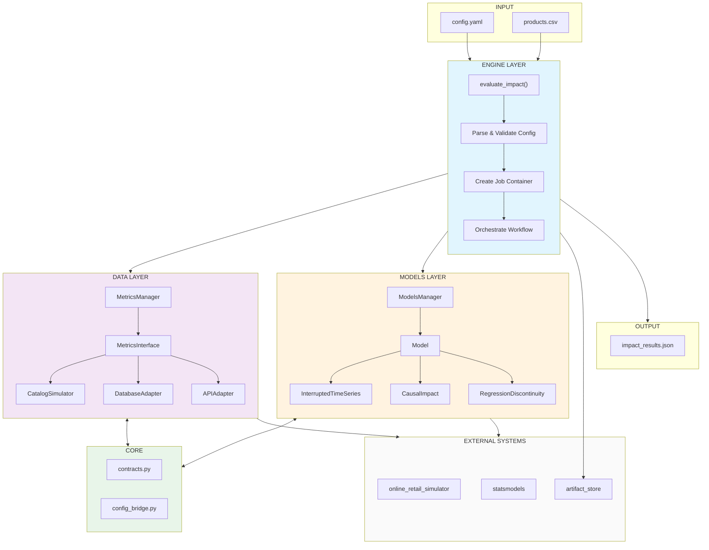
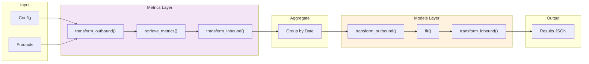
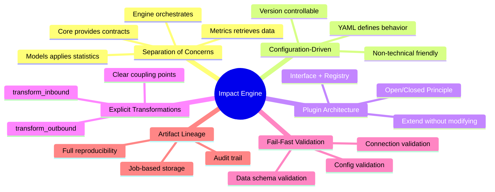
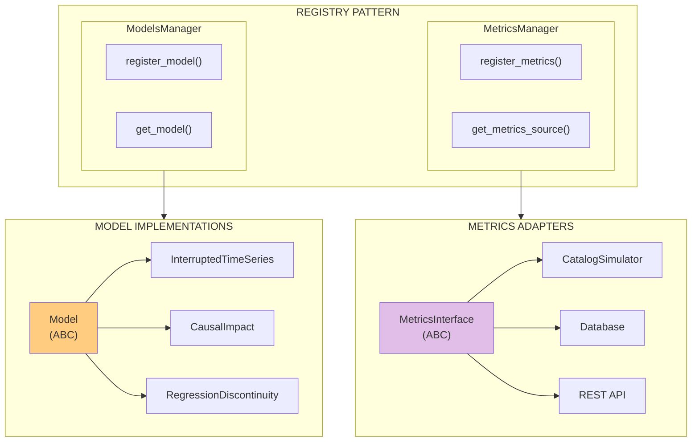

# Impact Engine

Evaluate causal impact of product interventions using business metrics and statistical modeling.

## Installation

```bash
pip install impact-engine
```

## Quick Start

```python
from impact_engine import evaluate_impact

# Products path is specified in config.yaml under DATA.PATH
result_path = evaluate_impact(
    config_path='config.yaml',
    storage_url='./results'
)
```

## Architecture

Impact Engine follows a clean three-layer architecture with plugin-based extensibility.

### System Overview



### Data Flow Pipeline



### Design Principles



### Plugin Architecture



## Documentation

- [User Stories](documentation/user-stories.md)
- [Configuration](documentation/configuration.md)
- [Design](documentation/design.md)

## License

MIT
