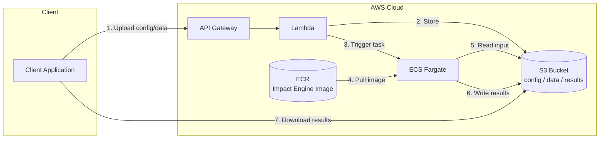

# AWS Architecture - Impact Engine

## Overview

Serverless architecture for running Impact Engine analysis jobs on AWS.

## Architecture Diagram



## Data Flow

| Step | Action | Service |
|------|--------|---------|
| 1 | Client uploads config and data paths | API Gateway |
| 2 | Lambda stores inputs in S3 | Lambda -> S3 |
| 3 | Lambda triggers ECS Fargate task | Lambda -> ECS |
| 4 | Fargate pulls container image | ECR -> ECS |
| 5 | Container reads input data | ECS -> S3 |
| 6 | Container writes analysis results | ECS -> S3 |
| 7 | Client downloads results | S3 -> Client |

## S3 Bucket Structure

```
s3://impact-engine/
└── {job_id}/
    ├── input/
    │   ├── config.json
    │   └── data/
    └── output/
        └── results/
```

Job-based structure emphasizes the stateless, job-oriented nature of the system.
