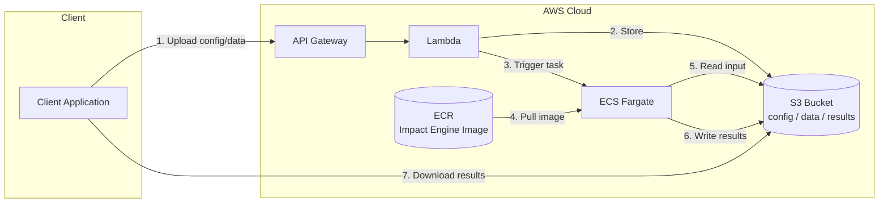

# Architecture

> **Note**: This is an advanced reference for contributors building custom adapters or models.
> For basic usage, see [Usage](usage.md).

This document describes the architecture and design principles of Impact Engine.

## Core Principles

Impact Engine is built on three foundational design principles:

### 1. Separation of Concerns

The system is organized into distinct layers:

- **Engine Layer**: Orchestrates the overall analysis workflow
- **Metrics Layer**: Handles data retrieval and standardization
- **Models Layer**: Applies statistical methods for causal inference

### 2. Plugin-Based Extensibility

Both metrics providers and models use a registry with decorator-based self-registration:

```python
from impact_engine.metrics.factory import METRICS_REGISTRY
from impact_engine.models.factory import MODEL_REGISTRY

# Register custom metrics provider
@METRICS_REGISTRY.register_decorator("salesforce")
class SalesforceAdapter(MetricsInterface):
    ...

# Register custom model
@MODEL_REGISTRY.register_decorator("my_model")
class MyModelAdapter(Model):
    ...
```

### 3. Configuration-Driven Behavior

All system behavior is controlled through declarative configuration. See [Configuration Reference](configuration.md) for details.

## Architecture Overview

```
┌─────────────────┐    ┌──────────────────┐    ┌─────────────────┐
│  engine.py      │───▶│ MetricsManager   │───▶│ MetricsInterface │
│ (evaluate_impact)│    └──────────────────┘    └─────────────────┘
└─────────────────┘             │                         ▲
         │                      ▼                         │
         │             ┌──────────────────┐              │
         │             │ Configuration    │              │
         │             │ Parser           │              │
         │             └──────────────────┘              │
         │                                               │
         │          ┌──────────────┬──────────────┬──────────────┐
         │          ▼              ▼              ▼              ▼
         │   ┌──────────────┐ ┌──────────────┐ ┌──────────────┐ ┌──────────────┐
         │   │ Catalog      │ │ Database     │ │ API          │ │ Custom       │
         │   │ Simulator    │ │ Adapter      │ │ Adapter      │ │ Adapter      │
         │   └──────────────┘ └──────────────┘ └──────────────┘ └──────────────┘
         │
         ▼
┌──────────────────┐    ┌─────────────────┐
│ ModelsManager    │───▶│ Model           │
└──────────────────┘    └─────────────────┘
         │                       ▲
         │                       │
         ▼              ┌────────┴────────┬─────────────────┐
┌──────────────┐ ┌──────────────┐ ┌──────────────┐
│ Interrupted  │ │ Metrics      │ │ Custom       │
│ Time Series  │ │ Approximation│ │ Model        │
└──────────────┘ └──────────────┘ └──────────────┘
```

## Package Structure

```
impact_engine/
├── engine.py                    # Main orchestration engine
├── config.py                    # Configuration parsing (delegates to core.validation)
├── core/
│   ├── __init__.py             # Public API exports
│   ├── registry.py             # Generic Registry and FunctionRegistry classes
│   ├── contracts.py            # Schema definitions for data flow
│   ├── transforms.py           # Transform registry and apply_transform()
│   └── validation.py           # Centralized config validation pipeline
├── metrics/
│   ├── __init__.py             # Public API exports
│   ├── base.py                 # MetricsInterface abstract base class
│   ├── factory.py              # METRICS_REGISTRY and create_metrics_manager()
│   ├── manager.py              # MetricsManager coordination logic
│   ├── catalog_simulator/      # Built-in simulator adapter
│   │   ├── adapter.py
│   │   └── transforms.py
│   └── file/                   # Built-in file adapter
│       └── adapter.py
└── models/
    ├── __init__.py             # Public API exports
    ├── base.py                 # Model abstract base class + ModelResult
    ├── factory.py              # MODEL_REGISTRY and create_models_manager()
    ├── manager.py              # ModelsManager coordination logic
    ├── interrupted_time_series/  # Built-in ITS model
    │   ├── adapter.py
    │   └── transforms.py
    └── metrics_approximation/  # Built-in approximation model
        ├── adapter.py
        ├── transforms.py
        └── response_registry.py
```

## Interface Design

### Metrics Interface

```python
class MetricsInterface(ABC):
    # Required - must override
    @abstractmethod
    def connect(self, config: Dict[str, Any]) -> bool
    @abstractmethod
    def retrieve_business_metrics(self, products: pd.DataFrame, start_date: str, end_date: str) -> pd.DataFrame

    # Optional - have sensible defaults
    def validate_connection(self) -> bool  # Default: returns True
    def transform_outbound(self, products: pd.DataFrame, start_date: str, end_date: str) -> Dict[str, Any]  # Default: pass-through
    def transform_inbound(self, external_data: Any) -> pd.DataFrame  # Default: returns DataFrame as-is
```

### Model Interface

```python
class Model(ABC):
    # Required - must override
    @abstractmethod
    def connect(self, config: Dict[str, Any]) -> bool
    @abstractmethod
    def fit(self, data: pd.DataFrame, **kwargs) -> ModelResult
    @abstractmethod
    def validate_params(self, params: Dict[str, Any]) -> None

    # Optional - have sensible defaults
    def validate_connection(self) -> bool  # Default: returns True
    def validate_data(self, data: pd.DataFrame) -> bool  # Default: checks non-empty
    def get_required_columns(self) -> List[str]  # Default: empty list
    def transform_outbound(self, data: pd.DataFrame, **kwargs) -> Dict[str, Any]  # Default: pass-through
    def transform_inbound(self, model_results: Any) -> Dict[str, Any]  # Default: wrap in dict
```

### ModelResult

Models return a standardized `ModelResult` container, keeping models storage-agnostic:

```python
@dataclass
class ModelResult:
    model_type: str
    data: Dict[str, Any]
    metadata: Dict[str, Any] = field(default_factory=dict)
```

### Explicit Transformation

Each interface includes transformation methods:

- **Outbound**: Convert Impact Engine format to external system format
- **Inbound**: Convert external system response to Impact Engine format

## Data Flow

```
Configuration → Engine → MetricsManager → MetricsAdapter → External Data Source
                    ↓         ↓                ↓                    ↓
                ModelsManager → ModelAdapter → Statistical Library → Model Results
                    ↓                ↓                    ↓              ↓
            Standardized Data ← Transform Inbound ← Raw Data    Transform Inbound
                    ↓                                              ↓
            Analysis Output ← ← ← ← ← ← ← ← ← ← ← ← Standardized Results
```

## Validation Strategy

Validation is split between centralized config validation and adapter-specific validation to balance early failure with extensibility.

### Centralized Validation (core/validation.py)

Runs at startup via `process_config()`:

1. **File validation**: Config file exists and is readable
2. **Format validation**: Valid YAML/JSON syntax
3. **Default merging**: Deep merge user config with `config_defaults.yaml`
4. **Structure validation**: Required sections exist (`DATA`, `MEASUREMENT`, `SOURCE`, etc.)
5. **Parameter validation**: Date formats, date ordering, universal constraints

This catches structural errors before any expensive operations begin.

### Adapter-Specific Validation

Each model/adapter validates its own requirements via `validate_params()`:

```python
class InterruptedTimeSeriesAdapter(Model):
    def validate_params(self, params: Dict[str, Any]) -> None:
        if not params.get("intervention_date"):
            raise ValueError("intervention_date is required for ITS model")
```

**Why this design?** Extensibility. Custom adapters can define arbitrary parameters without modifying centralized validation code. The system doesn't need to know about `my_custom_param` for a user-defined model—the model validates itself.

### Validation Timing

| What | Where | When |
|------|-------|------|
| Config structure | `process_config()` | Startup |
| Date formats | `process_config()` | Startup |
| Connection | Manager constructors | Manager creation |
| Model params | `validate_params()` | Before `fit()` |
| Data shape | `validate_data()` | Inside `fit()` |

### Tradeoff

Model-specific validation occurs after metrics retrieval. For expensive data sources, consider validating params earlier in custom orchestration code.

## Error Handling

### Graceful Degradation

- Missing metrics return empty DataFrames with correct schema
- Model fitting errors are logged but don't crash the pipeline
- Transformation errors are handled with clear error messages

## Extension Points

### For Metrics Adapter Authors

1. Implement `MetricsInterface` (required: `connect`, `retrieve_business_metrics`)
2. Override optional methods as needed (`validate_connection`, `transform_outbound`, `transform_inbound`)
3. Use the registry decorator to self-register:
   ```python
   from impact_engine.metrics.factory import METRICS_REGISTRY

   @METRICS_REGISTRY.register_decorator("my_source")
   class MySourceAdapter(MetricsInterface):
       ...
   ```
3. Import your adapter module to trigger registration

### For Model Authors

1. Implement `Model` interface (required: `connect`, `fit`, `validate_params`)
2. Override optional methods as needed (`validate_data`, `get_required_columns`, etc.)
3. Return `ModelResult` from `fit()` — storage is handled by the manager
4. Use the registry decorator to self-register:
   ```python
   from impact_engine.models.factory import MODEL_REGISTRY

   @MODEL_REGISTRY.register_decorator("my_model")
   class MyModelAdapter(Model):
       def validate_params(self, params):
           # Validate YOUR model's required params here
           if not params.get("my_required_param"):
               raise ValueError("my_required_param is required")
       ...
   ```
5. Import your adapter module to trigger registration

### For Application Developers

1. Create configuration file referencing your adapter type
2. Ensure custom adapter modules are imported before calling the engine
3. Call `evaluate_impact()` from `engine.py`

## Built-in Components

### Metrics: Catalog Simulator

- Rule-based simulation for testing
- Deterministic output with seed control
- Produces standardized metrics schema

### Models: Interrupted Time Series

- SARIMAX with intervention dummy variable
- Single intervention point analysis
- Pre/post period comparison

## Performance

### Lazy Loading

- Metrics adapters connect on first use
- Models are initialized when fitting begins
- Configuration is parsed once and cached

### Caching

- Metrics data cached by date range and products
- Model results cached by configuration hash

## Security

- Database credentials via environment variables
- API keys stored separately from code
- No logging of sensitive business metrics
- Temporary files are cleaned up automatically

## Deployment

Serverless architecture for running Impact Engine analysis jobs on AWS.

### AWS Architecture



### Data Flow

| Step | Action | Service |
|------|--------|---------|
| 1 | Client uploads config and data paths | API Gateway |
| 2 | Lambda stores inputs in S3 | Lambda -> S3 |
| 3 | Lambda triggers ECS Fargate task | Lambda -> ECS |
| 4 | Fargate pulls container image | ECR -> ECS |
| 5 | Container reads input data | ECS -> S3 |
| 6 | Container writes analysis results | ECS -> S3 |
| 7 | Client downloads results | S3 -> Client |

### S3 Bucket Structure

```
s3://impact-engine/
└── {job_id}/
    ├── input/
    │   ├── config.json
    │   └── data/
    └── output/
        └── results/
```

Job-based structure emphasizes the stateless, job-oriented nature of the system.
