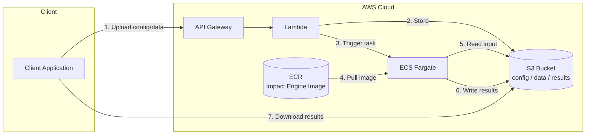

# Architecture

> **Note**: This is an advanced reference for contributors building custom adapters or models.
> For basic usage, see [Usage](usage.md).

This document describes the architecture and design principles of Impact Engine.

## Core Principles

Impact Engine is built on three foundational design principles:

### 1. Separation of Concerns

The system is organized into distinct layers:

- **Engine Layer**: Orchestrates the overall analysis workflow
- **Metrics Layer**: Handles data retrieval and standardization
- **Models Layer**: Applies statistical methods for causal inference

### 2. Plugin-Based Extensibility

Both metrics providers and models use a plugin architecture:

```python
# Register custom metrics provider
manager.register_metrics("salesforce", SalesforceAdapter)

# Register custom model
manager.register_model("causal_impact", CausalImpactModel)
```

### 3. Configuration-Driven Behavior

All system behavior is controlled through declarative configuration. See [Configuration Reference](configuration.md) for details.

## Architecture Overview

```
┌─────────────────┐    ┌──────────────────┐    ┌─────────────────┐
│  engine.py      │───▶│ MetricsManager   │───▶│ MetricsInterface │
│ (evaluate_impact)│    └──────────────────┘    └─────────────────┘
└─────────────────┘             │                         ▲
         │                      ▼                         │
         │             ┌──────────────────┐              │
         │             │ Configuration    │              │
         │             │ Parser           │              │
         │             └──────────────────┘              │
         │                                               │
         │          ┌──────────────┬──────────────┬──────────────┐
         │          ▼              ▼              ▼              ▼
         │   ┌──────────────┐ ┌──────────────┐ ┌──────────────┐ ┌──────────────┐
         │   │ Catalog      │ │ Database     │ │ API          │ │ Custom       │
         │   │ Simulator    │ │ Adapter      │ │ Adapter      │ │ Adapter      │
         │   └──────────────┘ └──────────────┘ └──────────────┘ └──────────────┘
         │
         ▼
┌──────────────────┐    ┌─────────────────┐
│ ModelsManager    │───▶│ Model           │
└──────────────────┘    └─────────────────┘
         │                       ▲
         │                       │
         ▼              ┌────────┴────────┬─────────────────┐
┌──────────────┐ ┌──────────────┐ ┌──────────────┐ ┌──────────────┐
│ Interrupted  │ │ Causal       │ │ Regression   │ │ Custom       │
│ Time Series  │ │ Impact       │ │ Discontinuity│ │ Model        │
└──────────────┘ └──────────────┘ └──────────────┘ └──────────────┘
```

## Package Structure

```
impact_engine/
├── engine.py                    # Main orchestration engine
├── config.py                    # Configuration parsing
├── metrics/
│   ├── __init__.py             # Public API exports
│   ├── base.py                 # MetricsInterface + common utilities
│   ├── manager.py              # MetricsManager coordination logic
│   └── adapter_catalog_simulator.py  # Built-in simulator
└── models/
    ├── __init__.py             # Public API exports
    ├── base.py                 # Model interface + common utilities
    ├── manager.py              # ModelsManager coordination logic
    └── adapter_interrupted_time_series.py  # Built-in ITS model
```

## Interface Design

### Metrics Interface

```python
class MetricsInterface(ABC):
    def connect(self, config: Dict[str, Any]) -> bool
    def validate_connection(self) -> bool
    def transform_outbound(self, products, start_date, end_date) -> Dict[str, Any]
    def transform_inbound(self, external_data) -> pd.DataFrame
    def retrieve_business_metrics(self, products, start_date, end_date) -> pd.DataFrame
```

### Model Interface

```python
class Model(ABC):
    def connect(self, config: Dict[str, Any]) -> bool
    def validate_connection(self) -> bool
    def transform_outbound(self, data, intervention_date, **kwargs) -> Dict[str, Any]
    def transform_inbound(self, model_results) -> Dict[str, Any]
    def fit(self, data, intervention_date, output_path, **kwargs) -> str
    def validate_data(self, data: pd.DataFrame) -> bool
    def get_required_columns(self) -> List[str]
```

### Explicit Transformation

Each interface includes transformation methods:

- **Outbound**: Convert Impact Engine format to external system format
- **Inbound**: Convert external system response to Impact Engine format

## Data Flow

```
Configuration → Engine → MetricsManager → MetricsAdapter → External Data Source
                    ↓         ↓                ↓                    ↓
                ModelsManager → ModelAdapter → Statistical Library → Model Results
                    ↓                ↓                    ↓              ↓
            Standardized Data ← Transform Inbound ← Raw Data    Transform Inbound
                    ↓                                              ↓
            Analysis Output ← ← ← ← ← ← ← ← ← ← ← ← Standardized Results
```

## Error Handling

### Fail Fast Principle

- Configuration validation at startup
- Connection validation before data retrieval
- Data schema validation before model fitting

### Graceful Degradation

- Missing metrics return empty DataFrames with correct schema
- Model fitting errors are logged but don't crash the pipeline
- Transformation errors are handled with clear error messages

## Extension Points

### For Metrics Adapter Authors

1. Implement `MetricsInterface`
2. Implement `connect()` and `validate_connection()` methods
3. Implement `transform_outbound()` and `transform_inbound()` methods
4. Handle source-specific connection logic
5. Register with `MetricsManager`

### For Model Authors

1. Implement `Model` interface
2. Implement `connect()` and `validate_connection()` methods
3. Implement `transform_outbound()` and `transform_inbound()` methods
4. Handle model-specific fitting logic
5. Produce standardized JSON output
6. Register with `ModelsManager`

### For Application Developers

1. Create configuration file
2. Register custom adapters (if needed)
3. Call `evaluate_impact()` from `engine.py`

## Built-in Components

### Metrics: Catalog Simulator

- Rule-based simulation for testing
- Deterministic output with seed control
- Produces standardized metrics schema

### Models: Interrupted Time Series

- SARIMAX with intervention dummy variable
- Single intervention point analysis
- Pre/post period comparison

## Performance

### Lazy Loading

- Metrics adapters connect on first use
- Models are initialized when fitting begins
- Configuration is parsed once and cached

### Caching

- Metrics data cached by date range and products
- Model results cached by configuration hash

## Security

- Database credentials via environment variables
- API keys stored separately from code
- No logging of sensitive business metrics
- Temporary files are cleaned up automatically

## Deployment

Serverless architecture for running Impact Engine analysis jobs on AWS.

### AWS Architecture



### Data Flow

| Step | Action | Service |
|------|--------|---------|
| 1 | Client uploads config and data paths | API Gateway |
| 2 | Lambda stores inputs in S3 | Lambda -> S3 |
| 3 | Lambda triggers ECS Fargate task | Lambda -> ECS |
| 4 | Fargate pulls container image | ECR -> ECS |
| 5 | Container reads input data | ECS -> S3 |
| 6 | Container writes analysis results | ECS -> S3 |
| 7 | Client downloads results | S3 -> Client |

### S3 Bucket Structure

```
s3://impact-engine/
└── {job_id}/
    ├── input/
    │   ├── config.json
    │   └── data/
    └── output/
        └── results/
```

Job-based structure emphasizes the stateless, job-oriented nature of the system.
