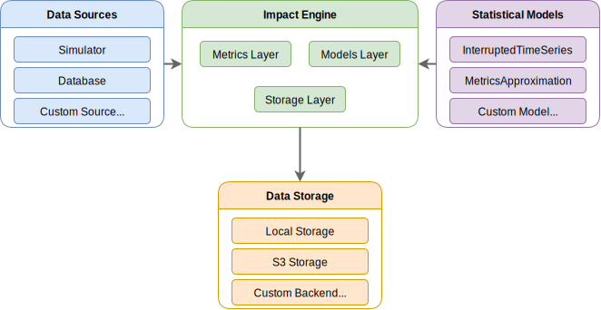
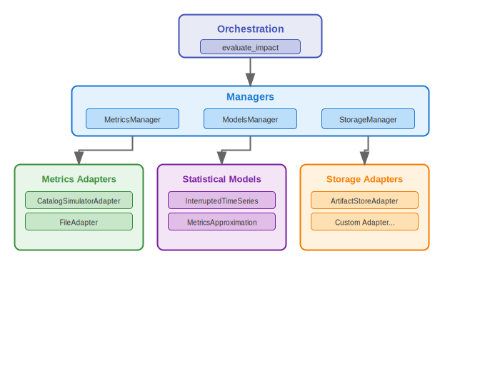

# Impact Engine Design

## Overview

Impact Engine measures the causal impact of interventions on business metrics. It answers questions like "Did this change improve our outcomes?" by comparing treatment and control groups using time-series analysis, metric approximations, and observational causal models.

The system is **configuration-driven** to support iterative development. As new data sources are onboarded and model requirements evolve, adapters and models can be added without modifying the core engine—and without changing how users interact with it. Each plugin implements a common interface, registers via decorators, and is discovered at runtime. The orchestration logic and user experience remain stable while capabilities grow.

---

## Architecture

The system is built as a **layered architecture**. At the top, [engine.py](../science/impact_engine/engine.py) orchestrates the workflow: it parses configuration, coordinates managers, and persists artifacts. The three managers ([MetricsManager](../science/impact_engine/metrics/manager.py), [ModelsManager](../science/impact_engine/models/manager.py), [StorageManager](../science/impact_engine/storage/manager.py)) handle validation and delegate to the appropriate adapters. Adapters implement the actual data retrieval, model fitting, or artifact persistence by connecting to external systems.

Data flows through five stages: configuration is parsed and validated with defaults merged in; the `MetricsManager` retrieves business data through whichever adapter the config specifies; **schema transformations** normalize column names to a standard format; the `ModelsManager` fits the configured statistical model; and finally, all artifacts—config, intermediate data, and results—are saved to a job directory for observability.

---

## Integration Pattern

External systems integrate through well-defined contracts rather than direct coupling. The three extension points—metrics adapters, statistical models, and storage adapters—follow the same pattern.

Three patterns make this work:

**Adapter pattern**: All three extension points implement a common interface. Metrics adapters implement [MetricsInterface](../science/impact_engine/metrics/base.py), which defines `connect()` and `retrieve_business_metrics()`. Statistical models implement [ModelInterface](../science/impact_engine/models/base.py), which defines `connect()` and `fit()`. Storage adapters implement [StorageInterface](../science/impact_engine/storage/base.py), which defines `connect()`, `write_json()`, `write_csv()`, and `full_path()`. The engine doesn't know or care which specific adapter it's using—it just calls the interface methods.

**Data contracts**: The [Schema system](../science/impact_engine/core/contracts.py) defines field mappings between external column names and the engine's standard schema. When the simulator returns `product_identifier` and `ordered_units`, the contract automatically translates these to `product_id` and `sales_volume`. Adding a new data source means defining its mappings once; the rest of the system works unchanged.

**Config bridge**: [ConfigBridge](../science/impact_engine/core/config_bridge.py) translates between Impact Engine's configuration format and whatever format external systems expect. The engine speaks one language; adapters and models translate as needed.

---

## Extensibility

The **plugin architecture** exists for a practical reason: development uses the simulator (which generates deterministic data with known ground truth for validating models), while production uses proprietary adapters that connect to real business data. These production adapters implement the same interfaces but live in private repositories. The boundary is clean—swap the config, swap the data source.

To add a new data source, implement [MetricsInterface](../science/impact_engine/metrics/base.py) and register with the [metrics registry](../science/impact_engine/metrics/factory.py). For a new model, implement [ModelInterface](../science/impact_engine/models/base.py) and register with the [model registry](../science/impact_engine/models/factory.py). For a new storage backend, implement [StorageInterface](../science/impact_engine/storage/base.py) and register with the [storage registry](../science/impact_engine/storage/factory.py). All three use **decorator-based self-registration**, so there's no central file to modify.

---

## Engineering Practices

The codebase follows standard best practices. [GitHub Actions](https://github.com/features/actions) runs tests and linting on every push; [Ruff](https://docs.astral.sh/ruff/) handles fast linting and formatting; [pre-commit](https://pre-commit.com/) hooks catch issues locally; and type hints throughout enable static analysis.

The architecture facilitates testing through **dependency injection**. Each manager receives its adapter through the constructor rather than creating it internally, so [unit tests](../science/impact_engine/tests/) can inject mock implementations that satisfy the interface contract. This means tests run fast and deterministically without requiring external systems. The same pattern applies across all three layers—metrics, models, and storage—making the entire codebase testable in isolation.

