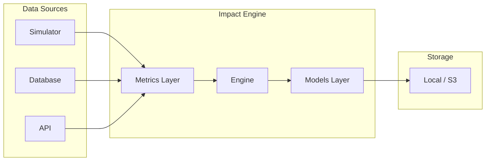
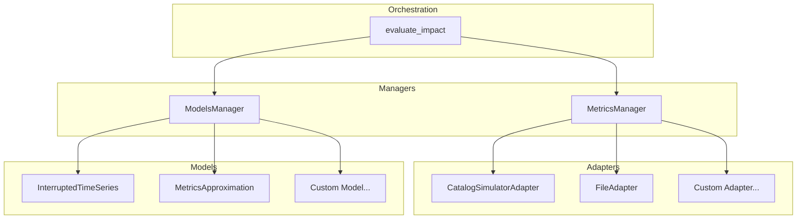
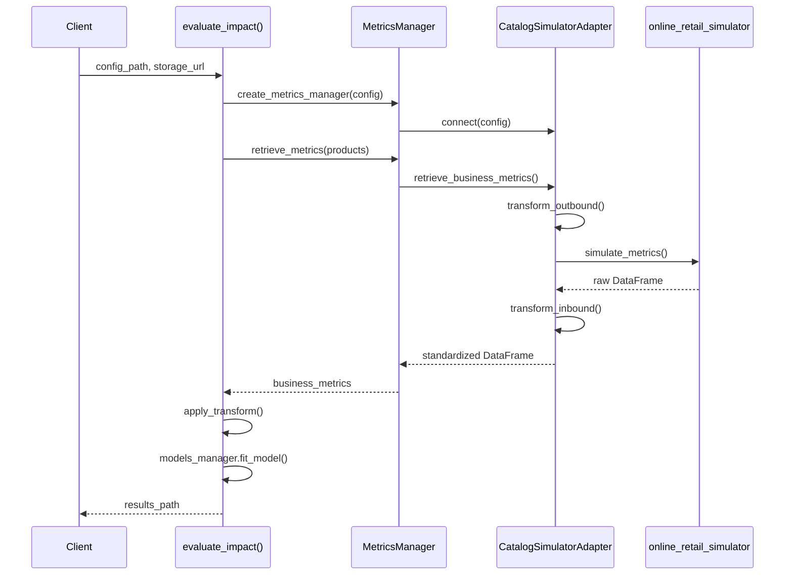

# Impact Engine Design

## Overview

Impact Engine measures the causal impact of product interventions on business metrics. It answers questions like *"Did improving product descriptions increase revenue?"* by comparing metrics before and after an intervention using statistical modeling.

The system is configuration-driven—analysis parameters are defined in YAML files rather than code. Data sources and statistical models are pluggable: adapters implement a common interface, register themselves via decorators, and the engine discovers them at runtime. This separation keeps the orchestration logic stable while allowing unlimited extensibility.

---

## Architecture

The system follows a layered architecture. At the top, [engine.py](../science/impact_engine/engine.py) orchestrates the workflow: it parses configuration, coordinates managers, and persists artifacts. The managers ([MetricsManager](../science/impact_engine/metrics/manager.py), [ModelsManager](../science/impact_engine/models/manager.py)) handle validation and delegate to the appropriate adapters. Adapters implement the actual data retrieval or model fitting by connecting to external systems.

Data flows through five stages: configuration is parsed and validated with defaults merged in; the metrics manager retrieves business data through whichever adapter the config specifies; schema transformations normalize column names to a standard format; the models manager fits the configured statistical model; and finally, all artifacts—config, intermediate data, and results—are saved to a job directory for observability.

---

## Integration Pattern

External systems integrate through well-defined contracts rather than direct coupling. The [Online Retail Simulator adapter](../science/impact_engine/metrics/catalog_simulator/adapter.py) demonstrates this pattern.

Three patterns make this work. First, the **adapter pattern**: every data source implements [MetricsInterface](../science/impact_engine/metrics/base.py), which defines `connect()` and `retrieve_business_metrics()`. The engine doesn't know or care whether it's talking to a simulator, database, or API—it just calls the interface methods.

Second, **data contracts**: the [Schema system](../science/impact_engine/core/contracts.py) defines field mappings between external column names and the engine's standard schema. When the simulator returns `product_identifier` and `ordered_units`, the contract automatically translates these to `product_id` and `sales_volume`. Adding a new data source means defining its mappings once; the rest of the system works unchanged.

Third, the **config bridge**: [ConfigBridge](../science/impact_engine/core/config_bridge.py) translates between Impact Engine's configuration format and whatever format external systems expect. The engine speaks one language; adapters translate as needed.

---

## Extensibility & Engineering Practices

The plugin architecture exists for a practical reason: development uses the simulator (which generates deterministic data with known ground truth for validating models), while production uses proprietary adapters that connect to real business data. These production adapters implement the same interfaces but live in private repositories. The boundary is clean—swap the config, swap the data source.

Adding a new data source means implementing [MetricsInterface](../science/impact_engine/metrics/base.py) and registering it with the [metrics registry](../science/impact_engine/metrics/factory.py). Adding a new model means implementing [Model](../science/impact_engine/models/base.py) and registering with the [model registry](../science/impact_engine/models/factory.py). Both use decorator-based self-registration, so there's no central file to modify.

The codebase follows standard engineering practices: GitHub Actions runs tests and linting on every push; pre-commit hooks catch issues locally; type hints throughout; and artifact storage is abstracted through `artifact_store` so the same code works against local filesystems or S3.

---

## Quick Start

Point the engine at a YAML config file that specifies the data source, date range, and model parameters. The [Usage guide](../documentation/usage.md) covers the config format in detail; the [Configuration reference](../documentation/configuration.md) documents all options.

The entry point is [evaluate_impact()](../science/impact_engine/engine.py)—pass it a config path and storage URL, and it returns the path to the results.
